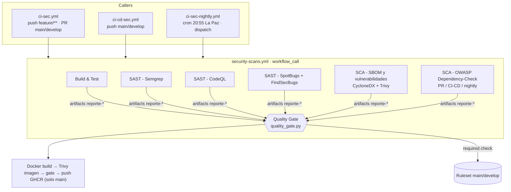
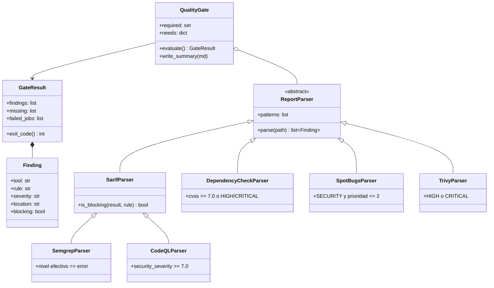
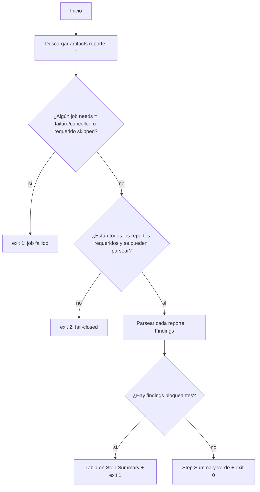
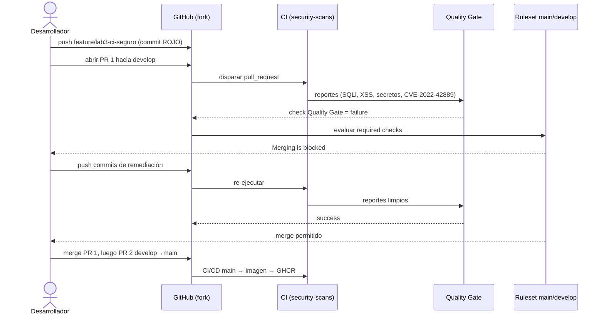
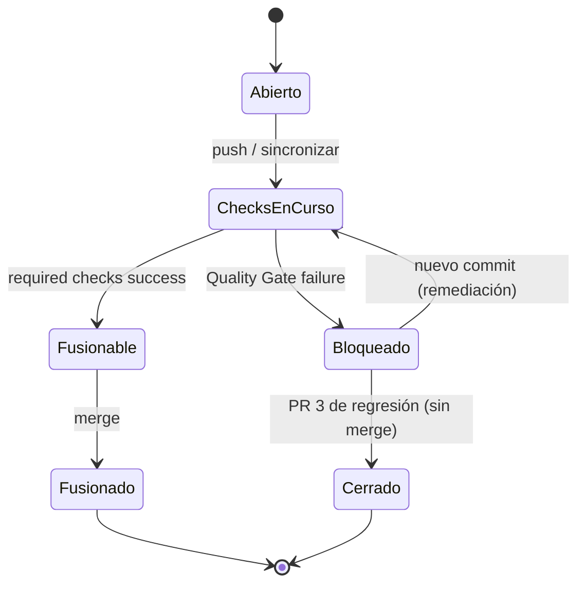
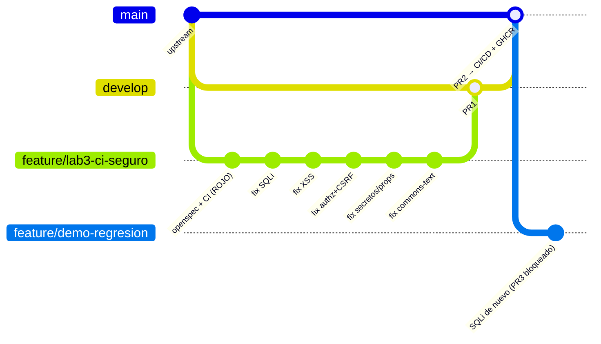
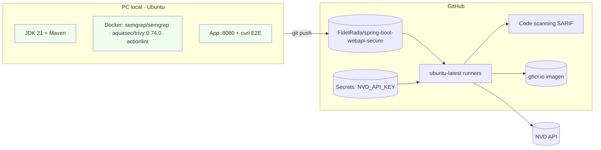
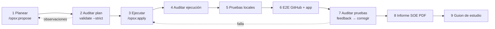

# Design: add-secure-ci-pipeline

## Context

Motivación en `proposal.md` (sección Why). Estado de partida verificado en el upstream (`584fd8d`):

- `ci-sec.yml`, `ci-cd-sec.yml` y `ci-sec-nightly.yml` repiten los mismos jobs; `JAVA_VERSION: '25'` frente a `<java.version>21</java.version>`.
- `ci-cd-sec.yml` también se dispara en `feature/**` y en PR (duplica CI) y usa `aquasecurity/trivy-action@0.36.0`, que no existe.
- El Dockerfile copia `mvnw`/`.mvn` (inexistentes) y usa `groupadd`/`useradd`/`curl` sobre Alpine.
- `security-semgrep.yml` tiene `branches: [feature/**', ...]` (YAML inválido) y usa `--config auto --metrics=on`.
- `pom.xml` contiene `<nvdApiKey>` en claro y `<failBuildOnCVSS>7</failBuildOnCVSS>` literal (un `-DfailBuildOnCVSS` no lo sobrescribe porque el literal del POM prevalece sobre la propiedad de usuario).
- La app conserva sus vulnerabilidades: este change NO modifica `src/main/**` (estrategia rojo → verde).

Restricciones: runners `ubuntu-latest`; repositorio público (Code scanning gratuito); artifacts con retención de 7 días; plazo 7/10/2026 00:00.

## Goals / Non-Goals

**Goals:**
- Un único workflow reutilizable con todos los escáneres y un gate que lee reportes.
- Gate fail-closed, probado con unittest y ejecutable en local con los mismos reportes.
- Merge bloqueado por ruleset con los nombres reales de los checks.
- Imagen construible, no root, escaneada y publicada solo desde `main`.

**Non-Goals:**
- Corregir las vulnerabilidades de la app (change `remediate-app-vulnerabilities`).
- PMD, Snyk, DAST y despliegues a staging/producción (los jobs de ejemplo se eliminan).
- Fijar acciones por SHA (se fijan por versión mayor; se documenta como mejora).

## Decisions

### D1. Workflow reutilizable + callers delgados
`security-scans.yml` (`on: workflow_call`) recibe inputs `run_dependency_check` (bool), `build_image` (bool), `push_image` (bool) y el secreto `NVD_API_KEY`. Los callers solo definen disparadores, `concurrency` y permisos. *Alternativa descartada*: composite actions por escáner (no permiten jobs paralelos ni artifacts por job).

| Caller | Disparadores | Job caller (`name`) | DC | Imagen | Push GHCR |
|---|---|---|---|---|---|
| `ci-sec.yml` | push `feature/**`, `bugfix/**`, `hotfix/**`; PR a `main`, `develop` | `CI (${{ github.event_name }})` | solo en PR | no | no |
| `ci-cd-sec.yml` | push `main`, `develop` | `CI-CD (${{ github.ref_name }})` | sí | sí | solo `main` |
| `ci-sec-nightly.yml` | `schedule` 20:55 La Paz, `workflow_dispatch` | `Nightly` | sí | sí | no |

Los checks resultantes se llaman `<job caller> / <job reutilizable>`, p. ej. `CI (pull_request) / Quality Gate` (CIW-12). El nombre exacto se confirma con `gh api .../check-runs` antes de crear el ruleset.

Verificado en la auditoría (fase 2, 2026-10-04):
- `jobs.<job_id>.name` admite los contextos `github, needs, strategy, matrix, vars, inputs` (docs "Contexts reference", tabla *Context availability*), así que `name: CI (${{ github.event_name }})` es válido en el job que llama al reutilizable; `actionlint` 1.7.12 no reporta nada sobre ello.
- Un job que llama a un reutilizable solo admite `name`, `uses`, `with`, `secrets`, `strategy`, `needs`, `if`, `concurrency` y `permissions` (docs "Reusing workflow configurations").
- **Permisos**: "The `GITHUB_TOKEN` permissions passed from the caller workflow can be only downgraded (not elevated) by the called workflow". Por eso el job caller SHALL conceder el máximo que necesita el reutilizable (`contents: read`, `actions: read`, `security-events: write` y, solo en `ci-cd-sec.yml`, `packages: write`), y cada job del reutilizable baja a lo mínimo que usa. El nivel de workflow de los tres callers queda en `contents: read`; el reutilizable no declara nivel de workflow (ver el ajuste de la fase 4 más abajo).

| Caller | Permisos del job caller |
|---|---|
| `ci-sec.yml` | `contents: read`, `actions: read`, `security-events: write` |
| `ci-cd-sec.yml` | `contents: read`, `actions: read`, `security-events: write`, `packages: write` |
| `ci-sec-nightly.yml` | `contents: read`, `actions: read`, `security-events: write` |

Ajuste en la implementación (fase 3): GitHub valida al **cargar** el workflow que ningún job anidado pida un permiso mayor que el concedido por el caller, aunque el job vaya a quedar `skipped`. Si el job de imagen del reutilizable declarara `packages: write`, los runs de `ci-sec.yml` y del nightly (que no lo conceden) fallarían al arrancar. Por eso el job `imagen` **no declara** bloque `permissions` y hereda exactamente lo que concede cada caller: `packages: write` solo existe cuando lo llama `ci-cd-sec.yml`. El resto de jobs del reutilizable sí declaran sus permisos mínimos.

Ajuste de la auditoría de ejecución (fase 4, hallazgo A-01): en un workflow llamado, el bloque `permissions` de nivel de workflow se aplica a todo job que no declare el suyo. Con `contents: read` en `security-scans.yml`, el job `imagen` quedaba solo con `contents: read` (sin `packages: write` para GHCR ni `security-events: write` para el SARIF). Por eso `security-scans.yml` ya no tiene nivel de workflow: cada job declara sus permisos mínimos y `imagen` hereda los del caller.

### D2. Jobs del reutilizable

| Job (`name`) | Herramienta / comando | Artifact | Falla solo por |
|---|---|---|---|
| Build & Test | `mvn -B clean verify` (JaCoCo) | `reporte-tests` | compilación o tests |
| SAST - Semgrep | contenedor `semgrep/semgrep:1.179.0`, `semgrep scan --metrics=off --config p/java --config p/owasp-top-ten --config p/secrets --config .semgrep.yml --sarif-output --json-output src/main/java` | `reporte-semgrep` | error técnico (código ≥ 2) |
| SAST - CodeQL | `github/codeql-action@v4` init/analyze con `languages: java-kotlin`, `build-mode: none`, `queries: security-and-quality`, `output: sarif-results`; `env: CODEQL_ACTION_DIFF_INFORMED_QUERIES: 'false'` a nivel de job | `reporte-codeql` | error técnico |
| SAST - SpotBugs | `mvn -B compile spotbugs:spotbugs` (plugin 4.9.8.5 + FindSecBugs 1.14.0), `xmlOutput=true` | `reporte-spotbugs` | error técnico |
| SCA - SBOM y vulnerabilidades | CycloneDX 2.9.3 → `docker run aquasec/trivy:0.74.0 sbom --scanners vuln --exit-code 0 --format json` (+ tabla) | `reporte-trivy-sbom` | SBOM ausente / error de Trivy |
| SCA - OWASP Dependency-Check | `mvn -B org.owasp:dependency-check-maven:check -Ddc.failBuildOnCVSS=11` (plugin 13.0.0; formatos HTML/JSON/SARIF configurados en el POM; `env: DO_NOT_TRACK: 'true'`) | `reporte-dependency-check` | error técnico |
| Quality Gate | `python3 .github/scripts/quality_gate.py` | `reporte-quality-gate` | hallazgos bloqueantes / reporte faltante |
| Imagen (opcional) | `docker build` → `trivy image` (2 pasadas, ver D5) → gate de imagen → `docker push` | `reporte-trivy-imagen` | HIGH/CRITICAL en imagen según D5 |

- Semgrep: `--config auto` no se puede combinar con `--metrics=off`. Verificado: `semgrep/semgrep:1.179.0 semgrep scan --config auto --metrics=off` termina con código 2 y `[ERROR]: Cannot create auto config when metrics are off. Please allow metrics or run with a specific config.` Por eso se listan rulesets explícitos. Sin `--error`, Semgrep sale 0 con hallazgos (verificado sobre el commit ROJO: 10 hallazgos, exit 0) y ≥ 2 con errores técnicos.
- Semgrep OSS 1.179.0 **no** escribe `level` en cada `result` del SARIF: el nivel está en `runs[].tool.driver.rules[].defaultConfiguration.level` (verificado). El parser SHALL resolver el nivel como `result.level` → `defaultConfiguration.level` de la regla → `warning` (valor por defecto de SARIF 2.1.0).
- CodeQL sin *diff-informed analysis* (hallazgo E-01 de la fase 6). En `pull_request`, codeql-action v4 activa por defecto `Feature.DiffInformedQueries` («Computing PR diff ranges…») y solo devuelve resultados en las líneas modificadas. En el PR rojo, el gate veía 1 de los 4 bloqueantes de CodeQL que da el push del mismo commit. Como el Quality Gate decide sobre el código que se fusiona, el job fija `CODEQL_ACTION_DIFF_INFORMED_QUERIES: 'false'`, mecanismo de `src/feature-flags.ts` de la acción: el valor `false` tiene prioridad sobre los feature flags remotos. Al desactivarlo también se desactiva el análisis *overlay* incremental, que solo se habilita junto con el diff-informed. Coste: el análisis del PR es completo, unos 1–2 min en este repo. Escenario SAST-08.
- CodeQL: `build-mode: none` es un modo soportado para Java (docs "CodeQL build options and steps for compiled languages": "Java: `none`, `autobuild`, or `manual`"; es el modo de la configuración por defecto para Java). Evita compilar en el job y no cambia las consultas. El SARIF de CodeQL guarda las reglas en `runs[].tool.extensions[].rules` (paquetes de consultas) además de `tool.driver.rules`; el parser busca `security-severity` en ambos.
- **Dependency-Check y umbral (justificación para el docente).** El umbral de bloqueo del laboratorio es CVSS ≥ 7.0 y no cambia. Lo que cambia es *quién* lo aplica en cada contexto:
  - En local, `mvn dependency-check:check` sin argumentos usa `failBuildOnCVSS=${dc.failBuildOnCVSS}` con la propiedad en `7`: el build **falla** con CVSS ≥ 7, como pide la consigna (SCA-12).
  - En el pipeline, el job se ejecuta con `-Ddc.failBuildOnCVSS=11`. CVSS no supera 10, así que el plugin nunca aborta por hallazgos y siempre termina de escribir los reportes HTML/JSON/SARIF. El Quality Gate lee ese JSON y bloquea con **CVSS ≥ 7.0 o severidad HIGH/CRITICAL** (D3). Si el plugin abortara, el job quedaría en `failure` sin un reporte completo y el gate no podría listar los CVE en el Step Summary; además se mezclarían fallos técnicos con hallazgos.
  - Resultado: el umbral efectivo del pipeline sigue siendo 7; `11` no es un umbral sino "el plugin no decide". El pipeline no tiene ninguna ruta en la que un CVSS ≥ 7 llegue a `main` (SCA-08).
  - Mecánica verificada con `mvn help:effective-pom`: sin override → `<failBuildOnCVSS>7`; `-Ddc.failBuildOnCVSS=11` → `11`; `-DfailBuildOnCVSS=11` → sigue en `7` (un literal o una expresión del POM no la sobrescribe la propiedad de usuario del plugin). Por eso se usa la propiedad `dc.failBuildOnCVSS`.
- La clave NVD llega como `env: NVD_API_KEY: ${{ secrets.NVD_API_KEY }}` y el POM la toma con `<nvdApiKeyEnvironmentVariable>NVD_API_KEY</nvdApiKeyEnvironmentVariable>`. Verificado con `mvn help:describe -Ddetail`: el parámetro existe en 11.1.1, 12.2.2 y 13.0.0 ("This is the recommended option to pass the API key in CI builds"); no hace falta el plan B con `-DnvdApiKey`.
- Versión del plugin: **13.0.0** (última de Maven Central, 2026-08-03; requiere maven-core ≥ 3.8.1: Maven local 3.8.7 y runners 3.9.x cumplen). Se descarta 11.1.1: cliente NVD antiguo (12.2.2 corrigió errores de parseo de marcas de tiempo de la NVD) y URL de OSS Index ya migrada.
- Configuración del POM: `<formats>` HTML, JSON y SARIF; `<suppressionFiles>` con `dependency-check-suppressions.xml`; `<dataDirectory>${user.home}/.cache/dependency-check-data</dataDirectory>`; `<ossIndexAnalyzerEnabled>false</ossIndexAnalyzerEnabled>` (desde 12.2.2 OSS Index migró a Sonatype Guide y requiere credenciales; sin ellas el analizador falla. La NVD es la fuente exigida por la consigna). En 12.x/13.x el nombre canónico es `ossIndexAnalyzerEnabled`; `ossindexAnalyzerEnabled` queda como alias.
- Telemetría: Dependency-Check ≥ 12.2.0 envía telemetría a Scarf; se desactiva con `DO_NOT_TRACK=true` en el job y en el script local (igual que `--metrics=off` en Semgrep).
- Caché de datos DC: `actions/cache` sobre `~/.cache/dependency-check-data` (configurado con `<dataDirectory>`), clave `dc-data-${{ runner.os }}-<año-semana>` con `restore-keys`, fuera de `~/.m2` para no invalidarse con el POM.
- Trivy: `aquasec/trivy:0.74.0` por `docker run` en todos los usos (la acción `trivy-action@0.36.0` no existe); caché en `$RUNNER_TEMP/trivy-cache`.
- SARIF de Semgrep, CodeQL, Dependency-Check y Trivy-imagen se suben con `github/codeql-action/upload-sarif` y `category` distinta.
- Cada job sube su artifact con `if: ${{ !cancelled() }}` y `if-no-files-found: error` (si el reporte no se generó, el job falla y el gate lo detecta).

### D3. Quality Gate fail-closed
Job con `needs: [todos]` e `if: ${{ !cancelled() }}`; recibe `NEEDS_JSON: ${{ toJSON(needs) }}` y la lista de reportes requeridos según inputs. Pasos: checkout → `actions/download-artifact` (`pattern: reporte-*`) → `python3 -m unittest discover -s .github/scripts/tests` → `quality_gate.py --reports-dir reportes --required semgrep,codeql,spotbugs,trivy[,dependency-check] --needs-json "$NEEDS_JSON" --summary "$GITHUB_STEP_SUMMARY"`.

Política de bloqueo:

| Herramienta | Formato | Bloquea si |
|---|---|---|
| Semgrep | SARIF | nivel efectivo `error` (`result.level` o, si falta, `defaultConfiguration.level` de la regla) |
| CodeQL | SARIF | regla con `security-severity` ≥ 7.0 (de `tool.driver.rules[]` o `tool.extensions[].rules[]`, `properties`) |
| SpotBugs + FindSecBugs | XML | `category == SECURITY` y `priority ≤ 2` (confianza alta o media) |
| Dependency-Check | JSON | CVSS v3/v4 ≥ 7.0 o severidad HIGH/CRITICAL; ignora `suppressedVulnerabilities` |
| Trivy SBOM | JSON | `Severity in {HIGH, CRITICAL}` (escaneo sin `--ignore-unfixed`) |
| Trivy imagen | JSON | `Severity in {HIGH, CRITICAL}`; los paquetes del SO llegan ya filtrados con `--ignore-unfixed` (D5) |

Evidencia que fijó la política de SpotBugs (auditoría, FindSecBugs 1.14.0 sobre el commit ROJO): `SPRING_CSRF_PROTECTION_DISABLED` prioridad 1 / rank 10; `SQL_INJECTION_SPRING_JDBC` prioridad 2 / rank 12; `CRLF_INJECTION_LOGS` prioridad 2 / rank 12; `SPRING_ENDPOINT` prioridad 3 / rank 15 (informativo, uno por controlador). La regla planificada inicialmente ("prioridad 1 o rank ≤ 9") **no** bloqueaba la inyección SQL; `priority ≤ 2` bloquea los tres hallazgos reales y deja fuera el informativo.

Gravedades CodeQL relevantes (metadatos `@security-severity` de las consultas en `github/codeql`): `java/sql-injection` 8.8, `java/spring-disabled-csrf-protection` 8.8, `java/xss` 7.8, `java/sensitive-log` 7.5 → bloquean; `java/log-injection` 6.1 y `java/stack-trace-exposure` 5.4 → se informan sin bloquear.

Códigos de salida: 0 aprobado; 1 hallazgos bloqueantes o jobs `failure`/`cancelled`/requeridos `skipped`; 2 reporte faltante o ilegible. Solo usa la biblioteca estándar de Python 3 (sin dependencias que instalar).

### D4. Ruleset
`.github/rulesets/proteger-main-develop.json` aplicado con `gh api -X POST repos/FidelRada/spring-boot-webapi-secure/rulesets --input ...`: `target: branch`, `enforcement: active`, `conditions.ref_name.include: [refs/heads/main, refs/heads/develop]`, `bypass_actors: []`, reglas `deletion`, `non_fast_forward`, `pull_request` (0 aprobaciones) y `required_status_checks` con `CI (pull_request) / Quality Gate` y `CI (pull_request) / Build & Test` (nombres a confirmar), `integration_id` de GitHub Actions (15368). *Alternativa*: branch protection clásica (descartada: no versionable de forma tan limpia y sin multi-rama).

Disponibilidad verificada en la fuente de la documentación (`github/docs`, `data/reusables/gated-features/repo-rules.md`): "Rulesets are available in public repositories with GitHub Free and GitHub Free for organizations, and in public and private repositories with GitHub Pro, Team, and GitHub Enterprise Cloud". El fork `FidelRada/spring-boot-webapi-secure` es público (`visibility: public`, cuenta de tipo `User`), así que `enforcement: active` aplica. Los *push rulesets* sí exigen Team, pero no se usan. Con `bypass_actors: []` el propietario tampoco puede saltarse las reglas (BP-06). A la fecha de la auditoría el repositorio tiene 0 rulesets y 0 secretos: se crean en la fase 6.

### D5. Imagen
Builder `maven:3.9-eclipse-temurin-21` (`mvn -B dependency:go-offline` + `package -DskipTests`), runtime `eclipse-temurin:21-jre-alpine`, `addgroup -S spring && adduser -S -G spring spring`, `HEALTHCHECK CMD wget -qO- http://localhost:8080/actuator/health || exit 1`. El job de imagen depende del Quality Gate (`needs: quality-gate`) y escanea la imagen con `aquasec/trivy:0.74.0` en dos pasadas:

1. `trivy image --scanners vuln --pkg-types os --ignore-unfixed --exit-code 0 --format json --output trivy-imagen-os.json`: paquetes del sistema operativo de la imagen base. `--ignore-unfixed` se aplica **solo aquí**, porque una CVE del SO sin versión corregida no se puede remediar desde este repositorio (solo cambiando o actualizando la imagen base, que ya usa el tag más reciente).
2. `trivy image --scanners vuln --pkg-types library --exit-code 0 --format json --output trivy-imagen-app.json`: dependencias de la aplicación dentro de la imagen, **sin** `--ignore-unfixed`, con la misma política que el SBOM (guía 02 §9).

Ajuste de la fase 4: la imagen se exporta con `docker save` y Trivy la lee con `--input` (sin montar el socket de Docker), corre con el usuario del runner y usa `--cache-dir` sobre una caché diaria de `actions/cache` compartida con el job SBOM; el nombre de la imagen en GHCR se pasa a minúsculas (`${GITHUB_REPOSITORY,,}`) y el reutilizable usa `defaults.run.shell: bash` (`-o pipefail`) para que `semgrep … | tee` no oculte un fallo técnico. Además se genera un SARIF completo (`--format sarif`, sin filtros) para Code scanning, para que lo no corregible siga visible. El gate evalúa ambos JSON con `quality_gate.py --only trivy-imagen` y solo hay push si `inputs.push_image` y la evaluación pasó. Esta política la aprobó el usuario en el plan. El SBOM de la aplicación (job SCA) se sigue escaneando sin `--ignore-unfixed`, como pide la guía. Comprobación del 2026-10-04: `eclipse-temurin:21-jre-alpine` (Alpine 3.24.2) tiene 0 HIGH/CRITICAL (solo 1 UNKNOWN), así que hoy el filtro no oculta nada; es una contingencia documentada.

### D6. Nightly y zona horaria
**Decisión (verificada):** `on.schedule: - cron: '55 20 * * *'` con `timezone: America/La_Paz`.
- Documentación oficial ("Events that trigger workflows", `schedule`): "You can optionally specify a timezone using an IANA timezone string for timezone-aware scheduling"; por defecto se usa UTC.
- `rhysd/actionlint:1.7.12`: un workflow con `timezone: America/La_Paz` sale con 0; una zona inventada da `invalid timezone "Mars/Olympus" in schedule event. it must be a valid IANA timezone name [events]`. O sea, la clave se conoce y se valida.
- Bolivia no tiene horario de verano (UTC-4 todo el año), así que equivale a `55 0 * * *` UTC. Si GitHub dejara de soportar la clave, esa es la alternativa directa.
- "Scheduled workflows run on the latest commit on the default branch" (`main`). En un fork hay que habilitarlo con `gh workflow enable`, y el evento puede retrasarse en momentos de carga. Por eso la evidencia principal es `workflow_dispatch` (CIW-04).

### D7. Escaneo local
Script `herramientas/escaneo_local.sh` (fuera del repo, en la carpeta del lab) que ejecuta Semgrep (Docker), Dependency-Check (Maven, `NVD_API_KEY` exportada), SpotBugs, CycloneDX + Trivy (Docker) y el gate, guardando todo en `evidencias/locales/{antes,despues}/`. CodeQL local queda fuera (no exigido: "CodeQL o Semgrep").

### D8. Versiones verificadas (auditoría 2026-10-04)

| Componente | Versión a usar | Fuente / comando |
|---|---|---|
| `actions/checkout` | `v7` (7.0.1) | `gh api repos/actions/checkout/releases/latest` |
| `actions/setup-java` | `v6` (6.0.1) | ídem |
| `actions/upload-artifact` | `v7` (7.0.1) | ídem |
| `actions/download-artifact` | `v8` (8.0.1; `digest-mismatch: error` por defecto) | ídem |
| `actions/cache` | `v6` (6.1.0) | ídem |
| `github/codeql-action` (init/analyze/upload-sarif) | `v4` (4.38.2) | tags `v4.*` (el `releases/latest` es un bundle `codeql-bundle-v2.27.1`) |
| `docker/setup-buildx-action` | `v4` (4.4.1) | `gh api .../releases/latest` |
| `docker/login-action` | `v4` (4.6.0) | ídem |
| `docker/metadata-action` | `v6` (6.2.0) | ídem |
| `docker/build-push-action` | `v7` (7.4.0) | ídem |
| `semgrep/semgrep` (Docker) | `1.179.0` | release 2026-10-02; `docker manifest inspect` OK |
| `aquasec/trivy` (Docker) | `0.74.0` (fijada por la guía 02; existe 0.75.0) | `docker manifest inspect aquasec/trivy:0.74.0` OK |
| `rhysd/actionlint` (Docker) | `1.7.12` | release 2026-03-30 |
| `org.owasp:dependency-check-maven` | `13.0.0` | `maven-metadata.xml` (latest/release) |
| `com.github.spotbugs:spotbugs-maven-plugin` | `4.9.8.5` | 4.10.x exige Maven ≥ 3.8.9 (verificado: "requires Maven version 3.8.9" con Maven 3.8.7 local); 4.9.8.5 exige 3.6.3 y analiza Java 21 sin errores |
| `com.h3xstream.findsecbugs:findsecbugs-plugin` | `1.14.0` | `maven-metadata.xml` (latest) |
| `org.cyclonedx:cyclonedx-maven-plugin` | `2.9.3` (schema 1.6) | `maven-metadata.xml` (latest = 2.9.3) |

Las acciones se fijan por versión mayor (`@v7`); fijarlas por SHA queda como mejora (Non-Goals). Dependabot (`github-actions`) propondrá las actualizaciones.

## Diagramas UML

### Casos de uso

### Componentes: pipeline y workflow reutilizable

### Clases: `quality_gate.py`

### Actividad: lógica del gate (fail-closed)

### Secuencia: PR rojo → verde con merge bloqueado

### Estados del PR

### Ramas

### Despliegue

### Cadena de subagentes

## Risks / Trade-offs

- [La primera descarga de la NVD tarda (10–30 min) o la API devuelve 403/503] → secreto `NVD_API_KEY`, caché semanal del directorio de datos, `timeout-minutes: 60`; plugin 13.0.0 (no 11.1.1). La primera ejecución local con la clave real se hace en la fase 3 (no hay `NVD_API_KEY` exportada en el equipo a fecha de la auditoría).
- [Maven local 3.8.7 frente a plugins que exigen ≥ 3.8.9 (spotbugs-maven-plugin 4.10.x)] → se fija 4.9.8.5. Si en el futuro hace falta 4.10.x, instalar Maven 3.9 o ejecutar con la imagen `maven:3.9-eclipse-temurin-21`.
- [CVE transitivos de Spring Boot 3.5.14 ya presentes (auditoría: 23 HIGH/CRITICAL en Trivy, entre ellos tomcat-embed-core 10.1.54, jackson 2.21.2, micrometer 1.15.11 y spring-webmvc 6.2.18)] → forman parte del ROJO esperado y se remedian en el change 2 (ver su D7).
- [Trivy o la NVD cambian y aparecen CVE transitivos HIGH en Spring Boot 3.5.14] → se gestionan en el change 2 (subir versión gestionada o supresión justificada con `until`); nunca se sube el umbral.
- [La imagen base Alpine trae CVE de SO HIGH/CRITICAL sin corrección y bloquea el push en `main`] → política D5 aprobada por el usuario: `--ignore-unfixed` solo en la pasada `--pkg-types os` de la imagen, el SARIF completo sigue visible, y las librerías de la app y el SBOM se escanean sin ese filtro. Hoy la base tiene 0 HIGH/CRITICAL.
- [El nombre real del check difiere del previsto y el ruleset exige un check que nunca llega (PR bloqueado para siempre)] → crear el ruleset solo después de leer `check-runs` del primer run.
- [CodeQL `security-and-quality` marca problemas de calidad] → el gate solo bloquea reglas con `security-severity` ≥ 7.0.
- [Los secretos no llegan a PRs de Dependabot] → registrar `NVD_API_KEY` también con `gh secret set --app dependabot`.
- [La clave `timezone` deja de ser aceptada] → usar `'55 0 * * *'` UTC (D6). Hoy está verificada en docs y en actionlint 1.7.12.
- [Semgrep `lab-sensitive-data-in-log` (WARNING) puede seguir marcando la línea de log del login aunque ya no incluya la password] → es `warning` y no bloquea; se documenta como no bloqueante en el Step Summary.
- [Artifacts expiran a los 7 días] → `gh run download` a `evidencias/pipeline/` en la fase E2E.

## Migration Plan

1. Commit ROJO en `feature/lab3-ci-seguro` (este change, sin tocar `src/main`).
2. Push → leer nombres de checks → aplicar ruleset → PR #1 bloqueado.
3. Rollback: revertir el commit de workflows; el ruleset se desactiva con `gh api -X PUT .../rulesets/<id> -f enforcement=disabled`.

## Open Questions

Resueltas en la auditoría (D6, D8 y D2): versiones de acciones y plugins, `timezone` del cron, FindSecBugs/SpotBugs y parámetros de Dependency-Check. Siguen abiertas, y se cierran con evidencia en la fase 6 (E2E):
- Nombres exactos de los check-runs (previstos `CI (pull_request) / Quality Gate` y `CI (pull_request) / Build & Test`), que se confirman con `gh api .../commits/<sha>/check-runs` antes de aplicar el ruleset.
- Duración real de la primera descarga NVD con la clave del secreto.
