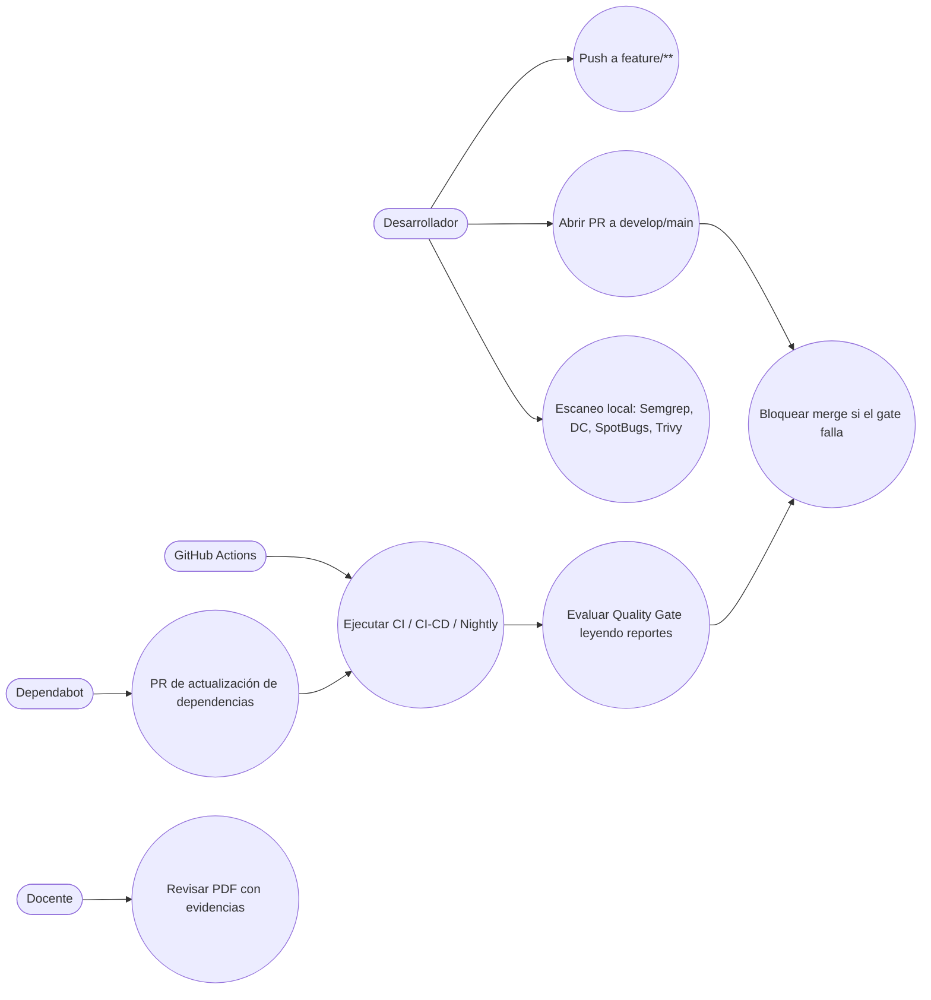
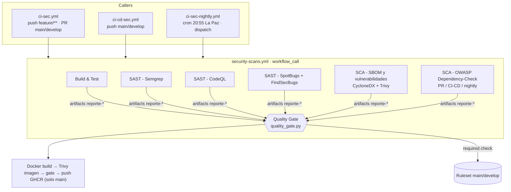
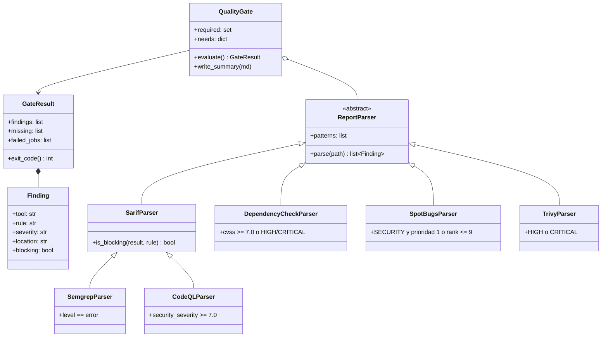
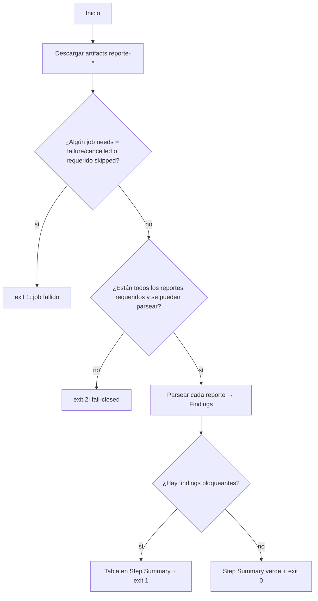
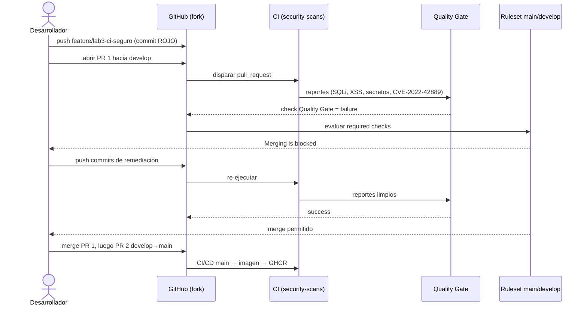
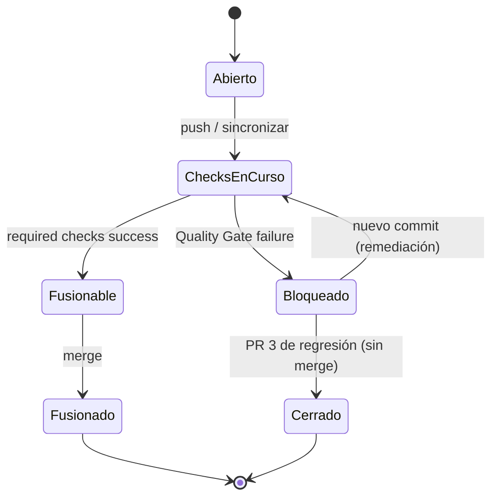
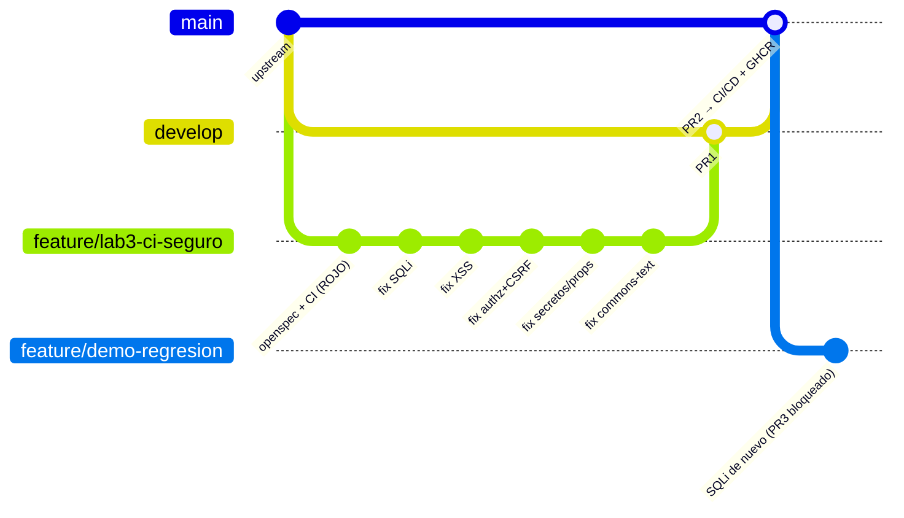
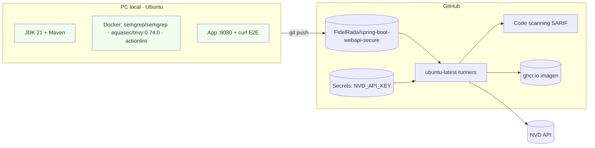
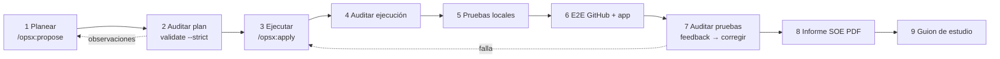

# Design: add-secure-ci-pipeline

## Context

Motivación en `proposal.md` (sección Why). Estado de partida verificado en el upstream (`584fd8d`):

- `ci-sec.yml`, `ci-cd-sec.yml` y `ci-sec-nightly.yml` repiten los mismos jobs; `JAVA_VERSION: '25'` frente a `<java.version>21</java.version>`.
- `ci-cd-sec.yml` también se dispara en `feature/**` y en PR (duplica CI) y usa `aquasecurity/trivy-action@0.36.0`, que no existe.
- El Dockerfile copia `mvnw`/`.mvn` (inexistentes) y usa `groupadd`/`useradd`/`curl` sobre Alpine.
- `security-semgrep.yml` tiene `branches: [feature/**', ...]` (YAML inválido) y usa `--config auto --metrics=on`.
- `pom.xml` contiene `<nvdApiKey>` en claro y `<failBuildOnCVSS>7</failBuildOnCVSS>` literal (un `-DfailBuildOnCVSS` no lo sobrescribe porque el literal del POM prevalece sobre la propiedad de usuario).
- La app conserva sus vulnerabilidades: este change NO modifica `src/main/**` (estrategia rojo → verde).

Restricciones: runners `ubuntu-latest`; repositorio público (Code scanning gratuito); artifacts con retención de 7 días; plazo 7/10/2026 00:00.

## Goals / Non-Goals

**Goals:**
- Un único workflow reutilizable con todos los escáneres y un gate que lee reportes.
- Gate fail-closed, probado con unittest y ejecutable en local con los mismos reportes.
- Merge bloqueado por ruleset con los nombres reales de los checks.
- Imagen construible, no root, escaneada y publicada solo desde `main`.

**Non-Goals:**
- Corregir las vulnerabilidades de la app (change `remediate-app-vulnerabilities`).
- PMD, Snyk, DAST y despliegues a staging/producción (los jobs de ejemplo se eliminan).
- Fijar acciones por SHA (se fijan por versión mayor; se documenta como mejora).

## Decisions

### D1. Workflow reutilizable + callers delgados
`security-scans.yml` (`on: workflow_call`) recibe inputs `run_dependency_check` (bool), `build_image` (bool), `push_image` (bool) y el secreto `NVD_API_KEY`. Los callers solo definen disparadores, `concurrency` y permisos. *Alternativa descartada*: composite actions por escáner (no permiten jobs paralelos ni artifacts por job).

| Caller | Disparadores | Job caller (`name`) | DC | Imagen | Push GHCR |
|---|---|---|---|---|---|
| `ci-sec.yml` | push `feature/**`, `bugfix/**`, `hotfix/**`; PR a `main`, `develop` | `CI (${{ github.event_name }})` | solo en PR | no | no |
| `ci-cd-sec.yml` | push `main`, `develop` | `CI-CD (${{ github.ref_name }})` | sí | sí | solo `main` |
| `ci-sec-nightly.yml` | `schedule` 20:55 La Paz, `workflow_dispatch` | `Nightly` | sí | sí | no |

Los checks resultantes se llaman `<job caller> / <job reutilizable>`, p. ej. `CI (pull_request) / Quality Gate` (CIW-12). El nombre exacto se confirma con `gh api .../check-runs` antes de crear el ruleset.

### D2. Jobs del reutilizable

| Job (`name`) | Herramienta / comando | Artifact | Falla solo por |
|---|---|---|---|
| Build & Test | `mvn -B clean verify` (JaCoCo) | `reporte-tests` | compilación o tests |
| SAST - Semgrep | contenedor `semgrep/semgrep` (tag fijado), `semgrep scan --metrics=off --config p/java --config p/owasp-top-ten --config p/secrets --config .semgrep.yml --sarif-output --json-output src/main/java` | `reporte-semgrep` | error técnico (código ≥ 2) |
| SAST - CodeQL | `github/codeql-action` init/autobuild/analyze, `security-and-quality`, `output: sarif` | `reporte-codeql` | error técnico |
| SAST - SpotBugs | `mvn -B compile spotbugs:spotbugs` con FindSecBugs, `xmlOutput=true` | `reporte-spotbugs` | error técnico |
| SCA - SBOM y vulnerabilidades | CycloneDX 2.9.3 → `docker run aquasec/trivy:0.74.0 sbom --scanners vuln --exit-code 0 --format json` (+ tabla) | `reporte-trivy-sbom` | SBOM ausente / error de Trivy |
| SCA - OWASP Dependency-Check | `mvn -B org.owasp:dependency-check-maven:check -Ddc.failBuildOnCVSS=11 -Dformats=HTML,JSON,SARIF` | `reporte-dependency-check` | error técnico |
| Quality Gate | `python3 .github/scripts/quality_gate.py` | `reporte-quality-gate` | hallazgos bloqueantes / reporte faltante |
| Imagen (opcional) | `docker build` → `trivy image` → gate de imagen → `docker push` | `reporte-trivy-imagen` | HIGH/CRITICAL en imagen |

- Semgrep: `--config auto` no se puede combinar con `--metrics=off` (error "Cannot create auto config when metrics are off"); por eso se listan rulesets explícitos. Código de salida 1 (hallazgos con `--error`) no se usa: sin `--error`, Semgrep sale 0 con hallazgos y ≥ 2 con errores.
- Dependency-Check: en CI el plugin no debe decidir el bloqueo, así que se ejecuta con `dc.failBuildOnCVSS=11` (nunca alcanzable) y el umbral real (CVSS ≥ 7) lo aplica el gate leyendo el JSON. En local la propiedad vale 7 por defecto, de modo que `mvn dependency-check:check` falla como pide la consigna. Esto no relaja el control: el umbral efectivo del pipeline sigue siendo 7 (SCA-08).
- La clave NVD llega como `env: NVD_API_KEY: ${{ secrets.NVD_API_KEY }}` y el POM la toma con `<nvdApiKeyEnvironmentVariable>NVD_API_KEY</nvdApiKeyEnvironmentVariable>` (preferido, no aparece en la línea de comandos); si la versión del plugin no lo soporta, `-DnvdApiKey="$NVD_API_KEY"` (enmascarado por Actions).
- Caché de datos DC: `actions/cache` sobre `~/.cache/dependency-check-data` (configurado con `<dataDirectory>`), clave `dc-data-${{ runner.os }}-<año-semana>` con `restore-keys`, fuera de `~/.m2` para no invalidarse con el POM.
- Trivy: `aquasec/trivy:0.74.0` por `docker run` en todos los usos (la acción `trivy-action@0.36.0` no existe); caché en `$RUNNER_TEMP/trivy-cache`.
- SARIF de Semgrep, CodeQL, Dependency-Check y Trivy-imagen se suben con `github/codeql-action/upload-sarif` y `category` distinta.
- Cada job sube su artifact con `if: ${{ !cancelled() }}` y `if-no-files-found: error` (si el reporte no se generó, el job falla y el gate lo detecta).

### D3. Quality Gate fail-closed
Job con `needs: [todos]` e `if: ${{ !cancelled() }}`; recibe `NEEDS_JSON: ${{ toJSON(needs) }}` y la lista de reportes requeridos según inputs. Pasos: checkout → `actions/download-artifact` (`pattern: reporte-*`) → `python3 -m unittest discover -s .github/scripts/tests` → `quality_gate.py --reports-dir reportes --required semgrep,codeql,spotbugs,trivy[,dependency-check] --needs-json "$NEEDS_JSON" --summary "$GITHUB_STEP_SUMMARY"`.

Política de bloqueo:

| Herramienta | Formato | Bloquea si |
|---|---|---|
| Semgrep | SARIF | `level == error` |
| CodeQL | SARIF | regla con `security-severity` ≥ 7.0 (de `tool.driver.rules[].properties`) |
| SpotBugs + FindSecBugs | XML | `category == SECURITY` y (`priority == 1` o `rank ≤ 9`) |
| Dependency-Check | JSON | CVSS v3/v4 ≥ 7.0 o severidad HIGH/CRITICAL; ignora `suppressedVulnerabilities` |
| Trivy (SBOM e imagen) | JSON | `Severity in {HIGH, CRITICAL}` |

Códigos de salida: 0 aprobado; 1 hallazgos bloqueantes o jobs `failure`/`cancelled`/requeridos `skipped`; 2 reporte faltante o ilegible. Solo usa la biblioteca estándar de Python 3 (sin dependencias que instalar).

### D4. Ruleset
`.github/rulesets/proteger-main-develop.json` aplicado con `gh api -X POST repos/FidelRada/spring-boot-webapi-secure/rulesets --input ...`: `target: branch`, `enforcement: active`, `conditions.ref_name.include: [refs/heads/main, refs/heads/develop]`, `bypass_actors: []`, reglas `deletion`, `non_fast_forward`, `pull_request` (0 aprobaciones) y `required_status_checks` con `CI (pull_request) / Quality Gate` y `CI (pull_request) / Build & Test` (nombres a confirmar), `integration_id` de GitHub Actions (15368). *Alternativa*: branch protection clásica (descartada: no versionable de forma tan limpia y sin multi-rama).

### D5. Imagen
Builder `maven:3.9-eclipse-temurin-21` (`mvn -B dependency:go-offline` + `package -DskipTests`), runtime `eclipse-temurin:21-jre-alpine`, `addgroup -S spring && adduser -S -G spring spring`, `HEALTHCHECK CMD wget -qO- http://localhost:8080/actuator/health || exit 1`. El job de imagen depende del Quality Gate (`needs: quality-gate`), escanea con `trivy image --exit-code 0 --format json/sarif`, evalúa con `quality_gate.py --only trivy-imagen` y solo hace push si `inputs.push_image` y la evaluación pasó.

### D6. Nightly y zona horaria
Bolivia no tiene horario de verano (UTC-4 todo el año), por lo que `cron: '55 0 * * *'` (UTC) equivale exactamente a 20:55 America/La_Paz. Se usará la clave `timezone: America/La_Paz` del bloque `schedule` solo si la documentación vigente de GitHub y `actionlint` la aceptan; si no, `'55 0 * * *'` con un comentario. El nightly corre sobre la rama predeterminada (`main`) y requiere `gh workflow enable` en el fork.

### D7. Escaneo local
Script `herramientas/escaneo_local.sh` (fuera del repo, en la carpeta del lab) que ejecuta Semgrep (Docker), Dependency-Check (Maven, `NVD_API_KEY` exportada), SpotBugs, CycloneDX + Trivy (Docker) y el gate, guardando todo en `evidencias/locales/{antes,despues}/`. CodeQL local queda fuera (no exigido: "CodeQL o Semgrep").

## Diagramas UML

### Casos de uso

### Componentes: pipeline y workflow reutilizable

### Clases: `quality_gate.py`

### Actividad: lógica del gate (fail-closed)

### Secuencia: PR rojo → verde con merge bloqueado

### Estados del PR

### Ramas

### Despliegue

### Cadena de subagentes

## Risks / Trade-offs

- [La primera descarga de la NVD tarda (10–30 min) o la API devuelve 403/503] → secreto `NVD_API_KEY`, caché semanal del directorio de datos, `timeout-minutes` amplio; si Dependency-Check 11.1.1 falla con la NVD actual, subir a 12.x tras probar en local.
- [Trivy o la NVD cambian y aparecen CVE transitivos HIGH en Spring Boot 3.5.14] → se gestionan en el change 2 (subir versión gestionada o supresión justificada con `until`); nunca se sube el umbral.
- [La imagen base Alpine trae CVE de SO HIGH/CRITICAL sin corrección y bloquea el push en `main`] → usar el tag más reciente de `eclipse-temurin:21-jre-alpine`; si persiste, documentar y evaluar `--ignore-unfixed` solo para la imagen con aprobación explícita del usuario.
- [El nombre real del check difiere del previsto y el ruleset exige un check que nunca llega (PR bloqueado para siempre)] → crear el ruleset solo después de leer `check-runs` del primer run.
- [CodeQL `security-and-quality` marca problemas de calidad] → el gate solo bloquea reglas con `security-severity` ≥ 7.0.
- [Los secretos no llegan a PRs de Dependabot] → registrar `NVD_API_KEY` también con `gh secret set --app dependabot`.
- [La clave `timezone` del cron no es aceptada] → usar `'55 0 * * *'` UTC (D6).
- [Artifacts expiran a los 7 días] → `gh run download` a `evidencias/pipeline/` en la fase E2E.

## Migration Plan

1. Commit ROJO en `feature/lab3-ci-seguro` (este change, sin tocar `src/main`).
2. Push → leer nombres de checks → aplicar ruleset → PR #1 bloqueado.
3. Rollback: revertir el commit de workflows; el ruleset se desactiva con `gh api -X PUT .../rulesets/<id> -f enforcement=disabled`.

## Open Questions

- Versión mayor vigente de cada acción (checkout, setup-java, cache, upload/download-artifact, codeql-action, docker/*) a fijar tras consultar `gh api repos/<owner>/<repo>/releases/latest` en la fase de ejecución.
- Versión exacta de FindSecBugs (`com.h3xstream.findsecbugs:findsecbugs-plugin`) y si conviene subir `spotbugs-maven-plugin` 4.8.6.2 a 4.9.x para Java 21.
