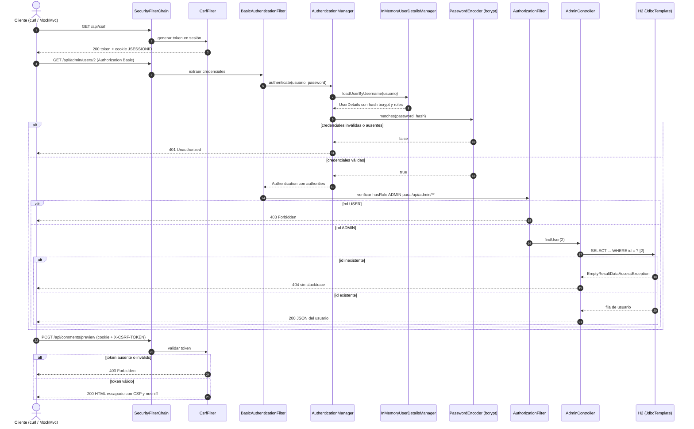
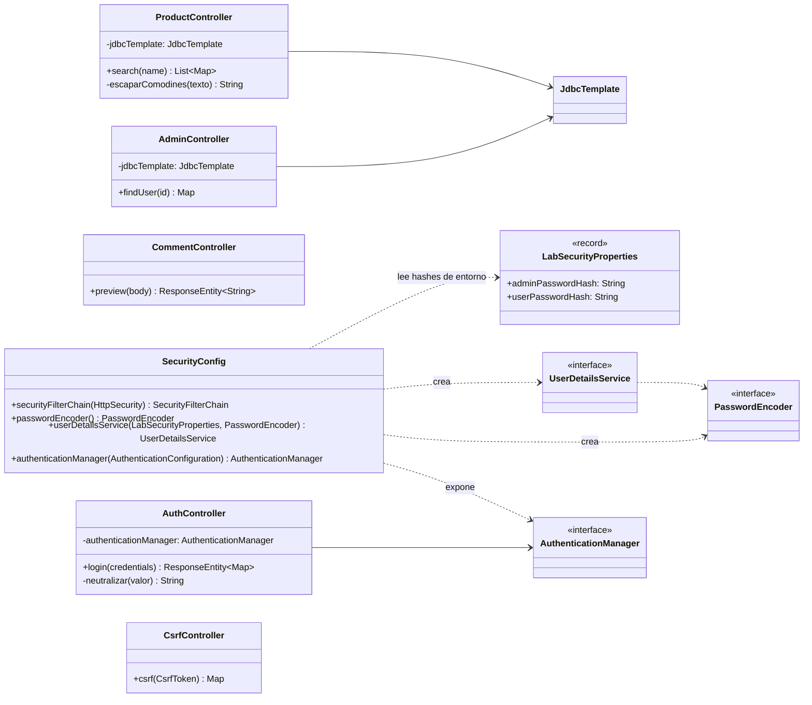

# Design: remediate-app-vulnerabilities

## Context

Motivación en `proposal.md`. Estado observado en `src/main/java/bo/edu/devsecops/**` (commit ROJO):

- `SecurityConfig`: `csrf.disable()` + `anyRequest().permitAll()`; no hay `UserDetailsService` ni `PasswordEncoder` (Spring Boot genera el usuario `user` con password aleatoria, que nadie usa).
- `ProductController.search`: `"... LIKE '%" + name + "%'"` con `jdbcTemplate.queryForList(sql)`.
- `CommentController.preview`: concatena `comment` en HTML (`text/html`).
- `AdminController.findUser`: consulta ya parametrizada (`WHERE id = ?`) pero sin autorización; `queryForMap` lanza `EmptyResultDataAccessException` (500 con stacktrace) si el id no existe.
- `AuthController.login`: `ADMIN_PASSWORD = "Admin123!"`, `JWT_SECRET` devuelto como "token", `LOGGER.info(..., password)`.
- `application.properties`: actuator `*`, `env.show-values=always`, H2 console con `web-allow-others`, `include-message/stacktrace=always`, `lab.external.api-key` en claro.
- Test `adminEndpointIsCurrentlyExposedForTheLab` exige el comportamiento inseguro (200 anónimo).

Restricción: el pipeline del change 1 (umbrales CVSS ≥ 7 / HIGH, SARIF `error`, `security-severity` ≥ 7, FindSecBugs SECURITY p1/rank ≤ 9) no se toca; la remediación debe dejar los reportes limpios por sí misma.

## Goals / Non-Goals

**Goals:**
- Eliminar cada hallazgo bloqueante del commit ROJO corrigiendo la causa, con una prueba MockMvc por escenario (APP-01..APP-19) y un E2E con curl antes/después.
- Mantener los endpoints y su forma de uso salvo los cambios **BREAKING** declarados.

**Non-Goals:**
- JWT, OAuth2 o base de usuarios persistente (se usa HTTP Basic + usuarios en memoria con hash bcrypt por entorno).
- Rate limiting, auditoría o bloqueo de cuentas.
- Cambiar el esquema H2 o los datos de ejemplo.

## Decisions

### D1. SQLi: parámetro enlazado
`jdbcTemplate.queryForList("SELECT id, name, price FROM products WHERE name LIKE ?", "%" + escaparComodines(name) + "%")`. Los comodines `%`/`_` del usuario se escapan (`ESCAPE '\'`) para que sean literales. *Alternativa*: `NamedParameterJdbcTemplate` (equivalente, más ruido). Pruebas: APP-01..APP-03.

### D2. XSS: codificación de salida + cabeceras
`HtmlUtils.htmlEscape(comment)` de Spring (sin dependencia nueva). Spring Security añade `X-Content-Type-Options: nosniff` y `X-Frame-Options: DENY` por defecto; se configura `headers.contentSecurityPolicy("default-src 'none'; style-src 'self'; frame-ancestors 'none'")`. *Alternativa*: devolver JSON en lugar de HTML (rompe el contrato del endpoint). Pruebas: APP-04, APP-05.

### D3. Autenticación y autorización
- `SecurityFilterChain`: rutas públicas `GET /api/products/search`, `POST /api/comments/preview`, `POST /api/auth/login`, `GET /api/csrf`, `GET /actuator/health`; `/api/admin/**` → `hasRole("ADMIN")`; `/actuator/**` → `hasRole("ADMIN")`; `anyRequest().authenticated()`; `httpBasic()`; `formLogin` deshabilitado.
- `PasswordEncoder`: `PasswordEncoderFactories.createDelegatingPasswordEncoder()` (bcrypt por defecto, admite prefijo `{bcrypt}`).
- `UserDetailsService`: `InMemoryUserDetailsManager` con `admin` (ADMIN) y `ana` (USER) cuyos hashes vienen de `lab.security.admin-password-hash=${LAB_ADMIN_PASSWORD_HASH:}` y `lab.security.user-password-hash=${LAB_USER_PASSWORD_HASH:}` (`@ConfigurationProperties` → record `LabSecurityProperties`). Si un hash falta, ese usuario no se registra y se emite un WARN sin datos sensibles; la app arranca igualmente (necesario para el healthcheck del contenedor).
- Los tests usan `src/test/resources/application.properties` con hashes bcrypt de contraseñas de prueba (no son secretos de producción) y `httpBasic(...)` de `spring-security-test`.
- `AdminController`: captura `EmptyResultDataAccessException` → `ResponseStatusException(NOT_FOUND)`. La consulta ya es parametrizada.
- *Alternativa descartada*: JWT firmado con secreto de entorno (más código, sin valor para la consigna). Pruebas: APP-06..APP-10.

### D4. CSRF
CSRF activo con el `HttpSessionCsrfTokenRepository` por defecto (evita una cookie `XSRF-TOKEN` sin `HttpOnly`, que Semgrep marcaría). `CsrfController` expone `GET /api/csrf` → `{"headerName":"X-CSRF-TOKEN","token":"..."}` y crea la sesión. Clientes: `curl -c cookies` → `GET /api/csrf` → `POST` con `-b cookies -H "X-CSRF-TOKEN: <token>"`. Pruebas MockMvc con `.with(csrf())` y sin él. Pruebas: APP-11, APP-12.

### D5. Login y logs
`AuthController` recibe `AuthenticationManager` (bean expuesto desde `AuthenticationConfiguration`) y llama a `authenticate(UsernamePasswordAuthenticationToken.unauthenticated(u, p))`. Éxito → `200 {"message":"Acceso autorizado","usuario":u,"roles":[...]}`; `AuthenticationException` → `401 {"error":"Credenciales incorrectas"}`. Se registra solo `usuario` neutralizado (`replaceAll("[\\r\\n]", "_")`) y el resultado, nunca la password. Se eliminan `ADMIN_PASSWORD` y `JWT_SECRET`. Pruebas: APP-13..APP-15 (`OutputCaptureExtension`).

### D6. Configuración
```properties
spring.h2.console.enabled=false
management.endpoints.web.exposure.include=health,info
management.endpoint.env.show-values=never
management.endpoint.health.show-details=never
server.error.include-message=never
server.error.include-stacktrace=never
server.error.include-binding-errors=never
lab.external.api-key=${LAB_EXTERNAL_API_KEY:}
```
Pruebas: APP-16..APP-19.

### D7. Dependencias
`commons-text` 1.9 → 1.10.0 (guía 02 §12; la clase no se usa en el código, eliminarla también sería válido, pero se conserva para documentar la comparación). Para cada CVE transitivo HIGH/CRITICAL que reporten Trivy o DC: 1) subir la propiedad gestionada por el parent (p. ej. `tomcat.version`, `jackson-bom.version`) a una versión corregida compatible y verificar `mvn verify`; 2) si es falso positivo o no aplicable, supresión en `dependency-check-suppressions.xml` con `<notes>` y `until` ≤ 90 días. Nunca se cambia el umbral. Pruebas: APP-20..APP-22.

### D8. Commits de remediación
Un commit por familia (para el gitGraph y el informe): `fix(sqli)`, `fix(xss)`, `fix(authz-csrf)`, `fix(secretos-config)`, `fix(deps)`, `test(seguridad)`. Cada commit compila y pasa sus propias pruebas.

## Diagramas UML

### Secuencia: autenticación, autorización y CSRF tras la remediación



### Clases: controladores y configuración de seguridad tras la remediación



## Risks / Trade-offs

- [Semgrep `p/java`/`p/owasp-top-ten` o CodeQL marcan algo nuevo en el código remediado (p. ej. log injection, CSRF en un endpoint)] → corregir la causa y añadir prueba; solo si es falso positivo demostrable, `// nosemgrep: <regla>` con justificación en el mismo commit (nunca deshabilitar el ruleset).
- [CVE transitivos de Spring Boot 3.5.14 sin versión corregida compatible] → supresión justificada con `until` y registro en `comparacion.md` como pendiente; si no es justificable, el gate seguirá rojo y se reporta al usuario.
- [Clientes del laboratorio (README, guías) dejan de funcionar por CSRF/401] → actualizar `README.md` con el flujo curl de D4 y la generación del hash (`htpasswd -bnBC 10 "" <clave> | tr -d ':\n'`).
- [El hash bcrypt en `src/test/resources` es marcado como secreto] → Semgrep se ejecuta sobre `src/main/java`; los valores son solo de prueba y se documentan como tales.
- [El healthcheck del contenedor falla si `/actuator/health` queda protegido] → ruta pública explícita (D3) y escenario APP-17.

## Migration Plan

1. Commits D8 sobre `feature/lab3-ci-seguro` → CI verde → merge PR #1 → CI/CD `develop`.
2. PR #2 `develop` → `main` → CI/CD `main` → GHCR.
3. Rollback: `git revert` del commit de la familia afectada (el gate volverá a rojo, que es el comportamiento esperado).
